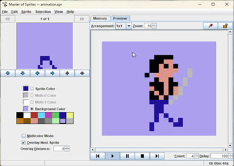

#  Master of Sprites
Java editor for Commodore 64 sprites. My humble competition for SpritePad.

**If you want to check the most recent version - jar file for download is [here](https://github.com/tstamborski/master-of-sprites/releases/download/v0.12/MasterofSprites.jar).**

