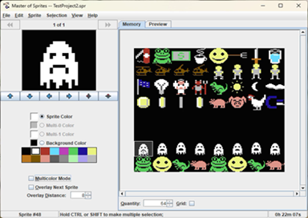

#  Master of Sprites
Java editor for Commodore 64 sprites. My small competition for SpritePad.

## Downloads

**If you want to check the most recent version - jar file for download is [here](https://github.com/tstamborski/master-of-sprites/releases/download/v1.0/MasterofSprites.jar).**

## Features

* Advanced preview with support for animations, sprite overlay and multi sprites made from a few connected single sprites.
* All basic sprite operations: sliding in all four directions, horizontal and vertical flip, reflecting, rotation and negation.
* Sprite operations accesible also for all sprites in the selection range (by corresponding command from selection menu).
* 4 different modes of ghost skinnning.
* Clipboard support with ability to copy/paste sprites between separate application windows or instances.
* Short manual included in the help menu.
* Included 5 small example projects.
* Undo/Redo mechanism.
* Ability to export projects in batch mode - now you can export sprite projects from level of makefile or shell script.
* Export to raw binary, prg file, assembly source code or image file (useful if you want to reap graphics from a memory dump; png, jpg and bmp files supported).
* Work time counter to see how long you were working on particular sprite project.
